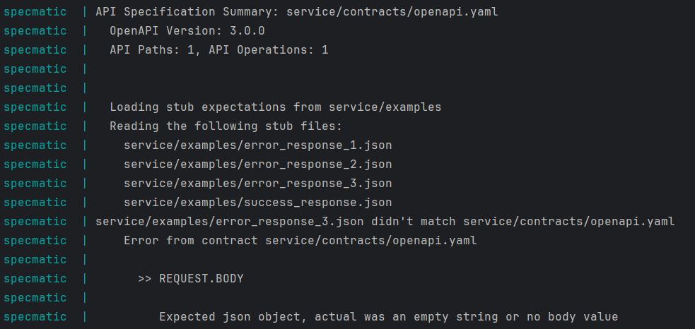

#### Description:

Specmatic seems to reject external examples containing invalid requests without body \
even though the status code indicates an error.

<br/>

#### Minimal Example:

🧾 OpenAPI specification:

```yaml
openapi: 3.0.0

info:
  title: Users Service
  version: 1.0.0

servers:
  - url: http://localhost:9000

paths:
  /register-user:
    post:
      requestBody:
        content:
          application/json:
            schema:
              type: object
              properties:
                id:
                  type: string
                  format: uuid
              required:
                - id
      responses:
        201:
          description: user successfully registered
        400:
          description: validation error
```

✔️ Example 1 - valid request - works:

```json
{
  "http-request": {
    "path": "/register-user",
    "method": "POST",
    "headers": {
      "Content-Type": "application/json"
    },
    "body": {
      "id": "4cee792f-6a93-43ec-80c7-a4f2e4e9ed49"
    }
  },
  "http-response": {
    "status": 201
  }
}
```

✔️ Example 2 - invalid id - works:

```json
{
  "http-request": {
    "path": "/register-user",
    "method": "POST",
    "headers": {
      "Content-Type": "application/json"
    },
    "body": {
      "id": "invalid"
    }
  },
  "http-response": {
    "status": 400
  }
}
```

✔️ Example 3 - missing id - works:

```json
{
  "http-request": {
    "path": "/register-user",
    "method": "POST",
    "headers": {
      "Content-Type": "application/json"
    },
    "body": {
    }
  },
  "http-response": {
    "status": 400
  }
}
```

❌  Example 4 - missing body - fails:

```json
{
  "http-request": {
    "path": "/register-user",
    "method": "POST"
  },
  "http-response": {
    "status": 400
  }
}
```

💻 Error:



<br/>

#### Steps To Reproduce:

- clone this repository
- execute docker compose up
- check the logs of the specmatic container
